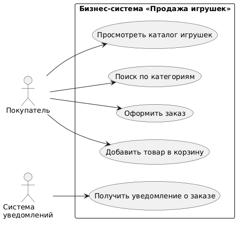
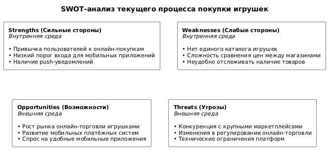

# Этап 0: Инициация и бизнес-анализ

## Цель этапа
Определить бизнес-контекст проекта интернет-магазина игрушек, выявить заинтересованные стороны, сформулировать основные цели и ограничения, а также создать глоссарий предметной области для мобильного приложения Toy Store.

## Результаты
- [Паспорт проекта (Executive Summary)](project-passport.md)
- [Глоссарий предметной области](glossary.md)
- [Диаграмма бизнес-контекста](<images/IDEF0 A-0.png>)
- [Диаграмма бизнес-прецедентов](<images/BUC.png>)
- [Модель бизнес-классов](<images/Бизнес классы.png>)
- [Матрица стейкхолдеров](<images/Матрица стейкхолдеров.png>)
- [SWOT-анализ текущего процесса покупки игрушек](<images/SWOT-анализ.png>)

## Диаграмма бизнес-контекста (IDEF0 A-0)

Диаграмма отображает систему «Toy Store» как единый процесс (A-0) с входными данными (запросы пользователей, каталог товаров), управляющими воздействиями (правила магазина, политика безопасности), механизмами реализации (Android-приложение, Spring Boot сервер) и выходными данными (оформленные заказы, уведомления).

## Диаграмма бизнес-прецедентов (BUC)

BUC-диаграмма описывает основные бизнес-процессы системы с точки зрения стейкхолдеров: просмотр каталога, добавление в корзину, оформление заказа, получение уведомлений.

## Модель бизнес-классов

Описывает ключевые сущности предметной области и связи между ними на уровне бизнес-анализа (до проектирования структуры базы данных): User, Toy, Category, Cart, Order.

## Матрица стейкхолдеров

Определяет заинтересованные стороны (покупатель, администратор магазина, преподаватель-заказчик, поставщики инфраструктуры), их интересы и степень влияния на проект.

## SWOT-анализ

Анализ сильных и слабых сторон, возможностей и угроз для текущего процесса покупки игрушек, обосновывающий необходимость разработки мобильного приложения.

