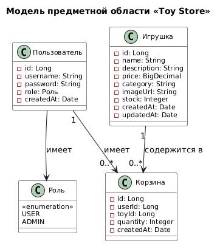

# Этап 1: Проектирование требований

## Цель этапа
Переход от бизнес-анализа к системным требованиям: определение функциональности мобильного приложения интернет-магазина игрушек, границ системы, основных акторов и сценариев использования.

## Результаты
- [Диаграмма вариантов использования (Use Case Diagram)](use-case-diagram.md)
- [Модель предметной области (Domain Model)](domain-model.md)
- [Спецификации ключевых прецедентов (UC3, UC6)](use-case-specifications.md)
- [Расширенный глоссарий (25+ терминов)](glossary-extended.md)
- [Таблица трассировки требований](traceability-matrix.md)

## Диаграмма вариантов использования

## Модель предметной области

