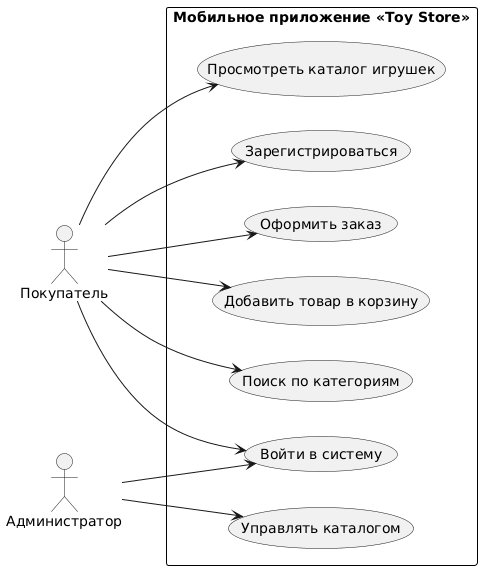

# Диаграмма вариантов использования (Use Case Diagram)

## Диаграмма

## Описание акторов

| Актор | Описание |
|-------|----------|
| **Пользователь (Покупатель)** | Основной пользователь мобильного приложения, просматривающий каталог, добавляющий товары в корзину и оформляющий заказы. |
| **Администратор** | Привилегированный пользователь, управляющий каталогом товаров (добавление, редактирование, удаление игрушек). |
| **Платёжная система** | Внешний сервис для обработки платежей (перспектива развития). |

## Перечень прецедентов

| ID | Прецедент | Краткое описание |
|----|-----------|------------------|
| UC1 | Зарегистрироваться | Создание новой учётной записи в системе. |
| UC2 | Войти в систему | Аутентификация пользователя по username/паролю, получение JWT-токена. |
| UC3 | Просмотреть каталог игрушек | Отображение всех доступных товаров с возможностью фильтрации. |
| UC4 | Поиск игрушек | Поиск товаров по названию, описанию или категории. |
| UC5 | Добавить товар в корзину | Добавление выбранной игрушки в корзину с указанием количества. |
| UC6 | Удалить товар из корзины | Удаление товара из корзины или изменение количества. |
| UC7 | Оформить заказ | Подтверждение заказа с товарами из корзины. |
| UC8 | Просмотреть историю заказов | Отображение списка заказов пользователя со статусами. |
| UC9 | Синхронизировать данные | Ручной или автоматический запуск обмена данными с сервером. |
| UC10 | Управлять каталогом | Добавление, редактирование, удаление товаров (только администратор). |
