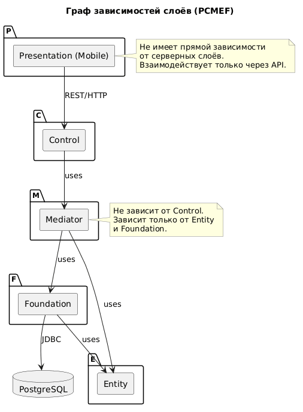

# Этап 2: Архитектурное проектирование

## Цель этапа

Разработать архитектуру программной системы на основе паттерна PCMEF, адаптированного для траектории В (мобильная разработка). Определить слои, их ответственности, интерфейсы взаимодействия и ключевые архитектурные решения.

## Результаты

- [Диаграмма пакетов PCMEF](pcmef-diagram.md)
- [Описание слоёв PCMEF](Описание%20слоёв%20PCMEF-диаграммы.md)
- [Спецификация интерфейсов между слоями](interfaces.md)
- [Архитектурные решения (ADR)](adr.md)

---

## Диаграмма пакетов PCMEF

---

## Диаграмма зависимостей

