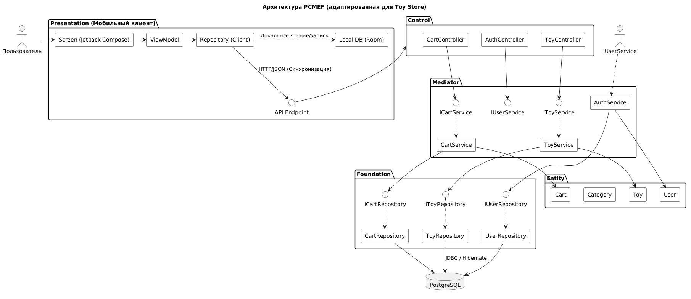

# Диаграмма пакетов PCMEF

## Диаграмма



## Общее описание

Архитектурный паттерн PCMEF (Presentation-Control-Mediator-Entity-Foundation) адаптирован для клиент-серверной архитектуры мобильного приложения «Toy Store».

Система разделена на два физических уровня:
- **Клиент** — мобильное Android-приложение (Kotlin + Jetpack Compose). Реализует слой Presentation.
- **Сервер** — Spring Boot-приложение (Java). Реализует слои Control, Mediator, Entity, Foundation.

Взаимодействие между клиентом и сервером осуществляется исключительно через REST API с использованием JWT-аутентификации.

## Слои архитектуры

### P — Presentation (Мобильное приложение)

Отвечает за отображение данных пользователю и обработку его действий.

- `Activity` — хост для Compose-экранов
- `ViewModel` — хранение UI-состояния, реагирует на изменения через `StateFlow`
- `Screens` — экраны приложения (ToyListScreen, CartScreen, ToyDetailScreen)
- `RetrofitClient` — HTTP-клиент для обращения к серверному API
- `Room Database` — локальное кэширование данных

### C — Control (REST-контроллеры)

Обрабатывает входящие HTTP-запросы, валидирует входные данные, маршрутизирует к соответствующим сервисам.

- `AuthController` — `/api/auth/**` (login, register)
- `ToyController` — `/api/toys/**` (CRUD игрушек)
- `CartController` — `/api/cart/**` (CRUD корзины)
- `FileController` — `/api/upload/**` (загрузка изображений)

### M — Mediator (Сервисы бизнес-логики)

Содержит бизнес-правила и оркестрирует взаимодействие между слоями Control и Foundation.

- `UserService` / `IUserService`
- `ToyService` / `IToyService`
- `CartService` / `ICartService`
- `AuthService` — генерация и валидация JWT-токенов

### E — Entity (JPA-сущности)

Представляют доменные объекты, отображённые на таблицы базы данных.

- `User`
- `Toy`
- `Cart`

### F — Foundation (Репозитории)

Обеспечивают доступ к данным через абстракцию JPA Repository.

- `UserRepository`
- `ToyRepository`
- `CartRepository`

## Правила зависимостей

Зависимости направлены строго сверху вниз:
````
Presentation → (REST API) → Control
↓
Mediator
↓
Entity ← Foundation → БД (PostgreSQL)

````

- Control зависит от Mediator (через интерфейсы сервисов `IXxxService`).
- Mediator зависит от Foundation (через интерфейсы репозиториев `XxxRepository`).
- Foundation зависит от Entity и БД.
- Обратных зависимостей нет.
- Presentation взаимодействует с сервером только через REST API.