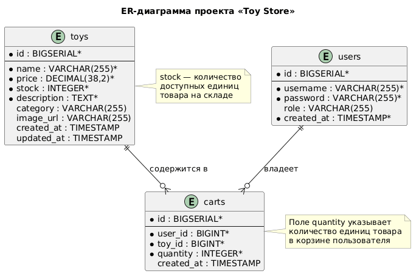

# Этап 4: Проектирование базы данных

## Цель этапа

Разработать логическую и физическую модель данных для серверной части мобильного приложения «Toy Store», создать DDL-скрипты для PostgreSQL и определить стратегию объектно-реляционного отображения (ORM) с использованием JPA/Hibernate.

## Результаты

- [ER-диаграмма логической модели данных](#er-диаграмма)
- [DDL-скрипты для PostgreSQL](ddl.sql)
- [Описание маппинга JPA-сущностей](#маппинг-jpa-сущностей)

---

## ER-диаграмма



---

## Описание таблиц

### `users` — Пользователи

| Столбец | Тип | Ограничения | Описание |
|---------|-----|-------------|----------|
| `id` | BIGSERIAL | PRIMARY KEY | Уникальный идентификатор |
| `username` | VARCHAR(255) | NOT NULL, UNIQUE | Имя пользователя (логин) |
| `password` | VARCHAR(255) | NOT NULL | BCrypt-хеш пароля |
| `role` | VARCHAR(255) | NOT NULL, DEFAULT 'USER' | Роль: `USER` или `ADMIN` |
| `created_at` | TIMESTAMP | NOT NULL, DEFAULT NOW() | Дата регистрации |

**Индексы:** `idx_users_username (username)` — быстрая аутентификация по username.

---

### `toys` — Игрушки (Товары)

| Столбец | Тип | Ограничения | Описание |
|---------|-----|-------------|----------|
| `id` | BIGSERIAL | PRIMARY KEY | Уникальный идентификатор |
| `name` | VARCHAR(255) | NOT NULL | Название игрушки |
| `description` | TEXT | NOT NULL | Описание товара |
| `price` | DECIMAL(38,2) | NOT NULL | Цена товара |
| `category` | VARCHAR(255) | NOT NULL | Категория (мягкие игрушки, конструкторы и т.д.) |
| `image_url` | VARCHAR(255) | — | URL изображения |
| `stock` | INTEGER | NOT NULL, DEFAULT 0 | Количество на складе |
| `created_at` | TIMESTAMP | NOT NULL, DEFAULT NOW() | Дата добавления |
| `updated_at` | TIMESTAMP | — | Дата последнего изменения |

**Индексы:**
- `idx_toys_category (category)` — фильтрация по категории
- `idx_toys_name_search (name)` — поиск по названию
- `idx_toys_stock (stock)` — проверка наличия

---

### `carts` — Корзина покупок

| Столбец | Тип | Ограничения | Описание |
|---------|-----|-------------|----------|
| `id` | BIGSERIAL | PRIMARY KEY | Уникальный идентификатор |
| `user_id` | BIGINT | NOT NULL, FK → users.id | Владелец корзины |
| `toy_id` | BIGINT | NOT NULL, FK → toys.id | Товар в корзине |
| `quantity` | INTEGER | NOT NULL, CHECK > 0 | Количество товаров |
| `created_at` | TIMESTAMP | NOT NULL, DEFAULT NOW() | Дата добавления в корзину |

**Ограничения:**
- UNIQUE (user_id, toy_id) — один товар может быть в корзине только один раз
- FOREIGN KEY (user_id) REFERENCES users(id) ON DELETE CASCADE
- FOREIGN KEY (toy_id) REFERENCES toys(id) ON DELETE CASCADE

**Индексы:** `idx_carts_user (user_id)` — быстрая загрузка корзины пользователя.

---

## Маппинг JPA-сущностей

### Основные аннотации

```java
@Entity
@Table(name = "toys")
public class Toy {

    @Id
    @GeneratedValue(strategy = GenerationType.IDENTITY)
    private Long id;

    @Column(nullable = false, length = 255)
    private String name;

    @Column(nullable = false, columnDefinition = "TEXT")
    private String description;

    @Column(nullable = false, precision = 38, scale = 2)
    private BigDecimal price;

    @Column(nullable = false, length = 255)
    private String category;

    @Column(name = "image_url", length = 255)
    private String imageUrl;

    @Column(nullable = false)
    private Integer stock = 0;

    @Column(name = "created_at", nullable = false, updatable = false)
    @CreationTimestamp
    private LocalDateTime createdAt;

    @Column(name = "updated_at")
    @UpdateTimestamp
    private LocalDateTime updatedAt;

    @OneToMany(mappedBy = "toy", cascade = CascadeType.ALL, orphanRemoval = true)
    private List<Cart> carts = new ArrayList<>();
}
```

```java
@Entity
@Table(name = "carts")
public class Cart {

    @Id
    @GeneratedValue(strategy = GenerationType.IDENTITY)
    private Long id;

    @ManyToOne(fetch = FetchType.LAZY)
    @JoinColumn(name = "user_id", nullable = false)
    private User user;

    @ManyToOne(fetch = FetchType.LAZY)
    @JoinColumn(name = "toy_id", nullable = false)
    private Toy toy;

    @Column(nullable = false)
    private Integer quantity;

    @Column(name = "created_at", nullable = false, updatable = false)
    @CreationTimestamp
    private LocalDateTime createdAt;
}
```

### Стратегия каскадного удаления

При удалении `User` → каскадно удаляются все записи в `Cart`.  
При удалении `Toy` → каскадно удаляются все записи в `Cart`.

Реализовано через: `@ManyToOne` + `ON DELETE CASCADE` в DDL.

---

## Стратегия индексирования

| Индекс | Таблица | Столбцы | Цель |
|--------|---------|---------|------|
| `idx_users_username` | users | username | Быстрая аутентификация по username |
| `idx_toys_category` | toys | category | Фильтрация товаров по категории |
| `idx_toys_name_search` | toys | name | Поиск товаров по названию |
| `idx_toys_stock` | toys | stock | Проверка наличия на складе |
| `idx_carts_user` | carts | user_id | Быстрая загрузка корзины пользователя |

---

## Особенности реализации

### Типы данных

- **DECIMAL(38,2)** для цены — обеспечивает точность финансовых расчётов без ошибок округления
- **TEXT** для описания — позволяет хранить описания любой длины
- **TIMESTAMP** для дат — автоматическое отслеживание времени создания/изменения

### Ограничения целостности

1. **CHECK (stock >= 0)** — количество на складе не может быть отрицательным
2. **CHECK (quantity > 0)** — количество в корзине должно быть положительным
3. **UNIQUE (username)** — имя пользователя должно быть уникальным
4. **UNIQUE (user_id, toy_id)** — товар не может быть добавлен в корзину дважды

### Оптимизация запросов

Все часто используемые поля для поиска и фильтрации проиндексированы:
- Поиск по категории: `WHERE category = ?`
- Поиск по названию: `WHERE name ILIKE ?`
- Проверка наличия: `WHERE stock > 0`
- Загрузка корзины: `WHERE user_id = ?`