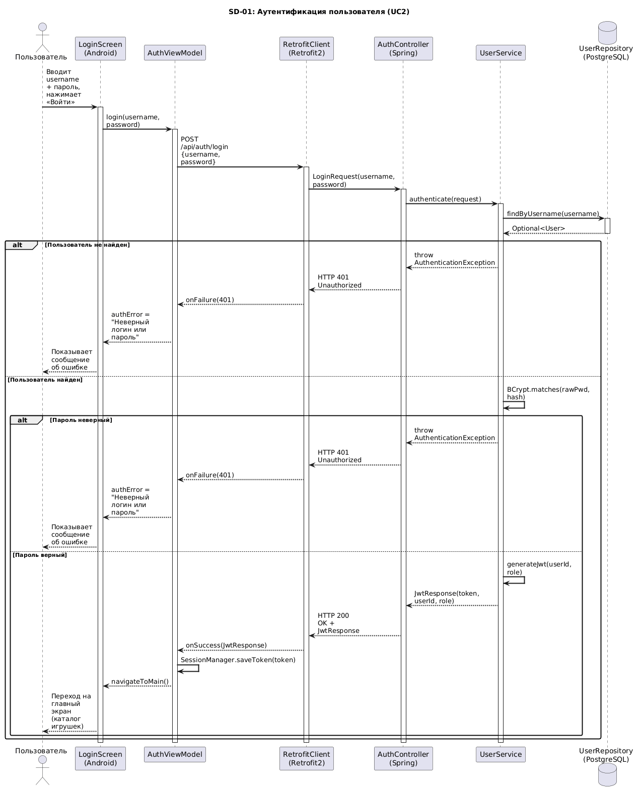
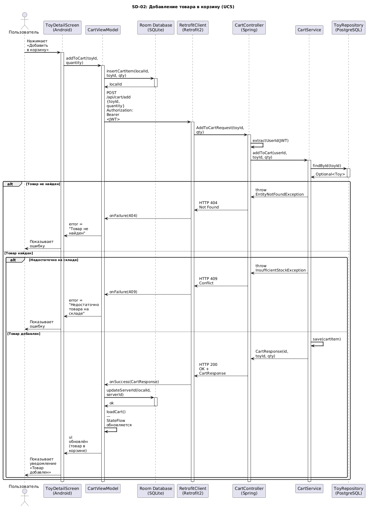
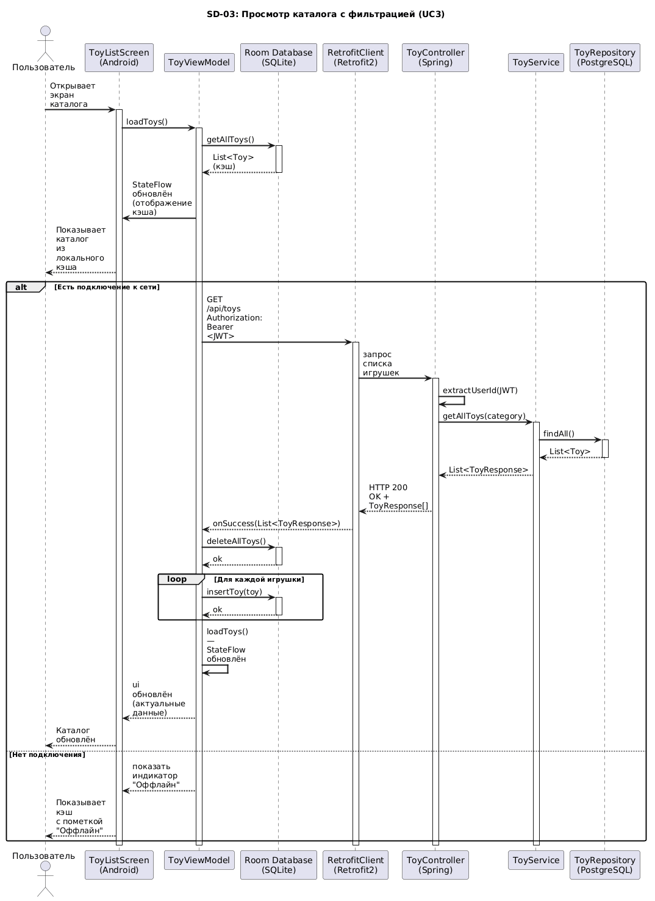
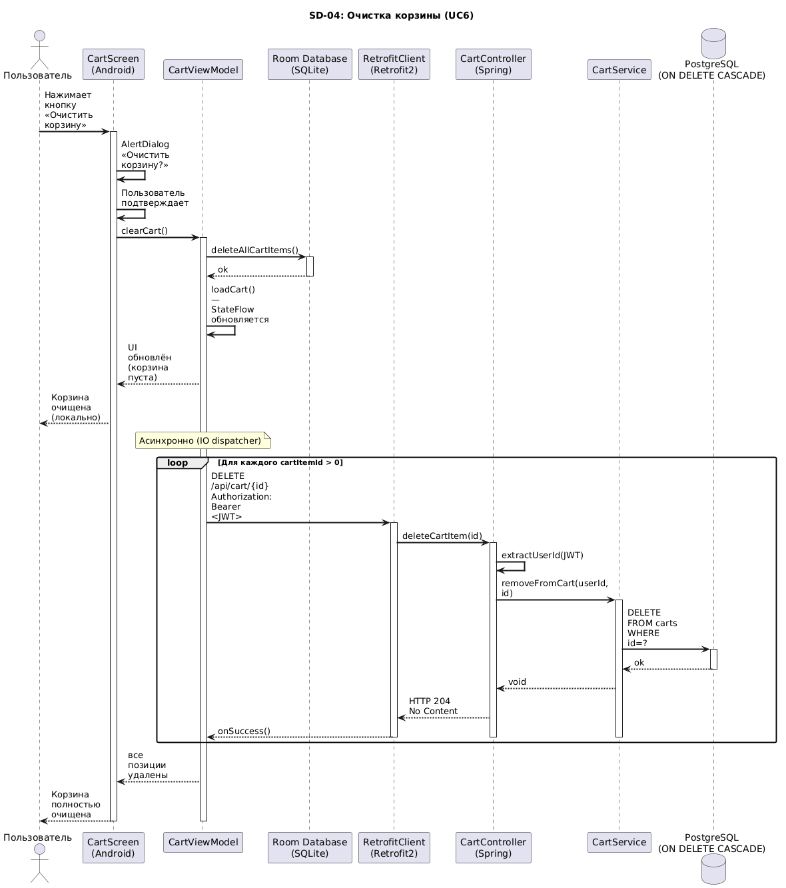

# Этап 4: Детальное проектирование (Недели 9–10)

## Цель этапа

Детализировать архитектурные решения до уровня, готового к реализации: описать взаимодействие компонентов в динамике, уточнить структуру классов проектирования и зафиксировать сигнатуры ключевых методов.

## Результаты

| Артефакт | Описание | Документ |
|---|---|---|
| Диаграммы последовательности | 3+ сценария взаимодействия | [sequence-diagrams.md](sequence-diagrams.md) |
| Диаграмма классов проектирования | Детальная структура всех слоёв | [class-diagram.md](class-diagram.md) |
| Спецификация методов | Сигнатуры ключевых методов | [method-specs.md](method-specs.md) |

---

## Диаграммы последовательности

### SD-01: Аутентификация пользователя (UC2)

### SD-02: Добавление товара в корзину (UC3)

### SD-03: Просмотр каталога с филтьтрацией (UC6)

### SD-04: Очистка корзины (UC5)

