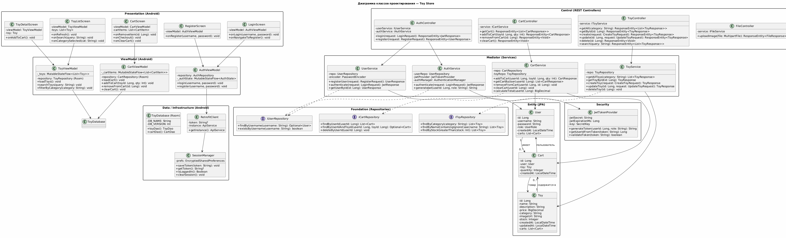

# Диаграмма классов проектирования

## Диаграмма


## Клиентская часть (Android)

### Слой Presentation

```
+---------------------------+       +---------------------------+
|      ToyListScreen        |       |     ToyDetailScreen       |
+---------------------------+       +---------------------------+
| - viewModel: ToyVM        |       | - viewModel: ToyVM        |
| - toys: List<Toy>         |       | - toy: Toy                |
+---------------------------+       | - onAddToCart: () -> Unit |
| + onRefresh()             |       +---------------------------+
| + onSearch(query: String) |       | + onAddToCart()           |
| + onCategorySelected()    |       +---------------------------+
+---------------------------+

+---------------------------+       +---------------------------+
|       CartScreen          |       |      LoginScreen          |
+---------------------------+       +---------------------------+
| - viewModel: CartVM       |       | - viewModel: AuthVM       |
| - cartItems: List<Cart>   |       | - username: String        |
+---------------------------+       | - password: String        |
| + onRemoveItem()          |       +---------------------------+
| + onCheckout()            |       | + onLogin()               |
| + onClearCart()           |       | + onNavigateToRegister()  |
+---------------------------+       +---------------------------+
```

### Слой ViewModel

```
+---------------------------+       +---------------------------+
|       ToyViewModel        |       |       CartViewModel       |
+---------------------------+       +---------------------------+
| - repository: ToyRepo     |       | - repository: CartRepo    |
| - _uiState: MutableState  |       | - _uiState: MutableState  |
+---------------------------+       +---------------------------+
| + loadToys()              |       | + loadCart()              |
| + searchToys(query)       |       | + addToCart(toyId, qty)   |
| + filterByCategory(cat)   |       | + removeFromCart(id)      |
+---------------------------+       | + clearCart()             |
+---------------------------+

+---------------------------+       +---------------------------+
|       AuthViewModel       |       |      SessionManager       |
+---------------------------+       +---------------------------+
| - repository: AuthRepo    |       | - prefs: EncryptedPrefs   |
| - _authState: MutableState|       +---------------------------+
+---------------------------+       | + saveToken(token)        |
| + login(username, pass)   |       | + getToken(): String?     |
| + register(username, pass)|       | + isLoggedIn(): Boolean   |
+---------------------------+       | + clearSession()          |
+---------------------------+
```

### Слой Data / Infrastructure

```
+---------------------------+       +---------------------------+
|    ToyDatabase (Room)     |       |       RetrofitClient      |
+---------------------------+       +---------------------------+
| - DB_NAME: String         |       | - token: String?          |
| - DB_VERSION: Int         |       | - instance: ApiService    |
+---------------------------+       +---------------------------+
| + toyDao(): ToyDao        |       | + getInstance()           |
| + cartDao(): CartDao      |       |   : ApiService            |
+---------------------------+       +---------------------------+
```

## Серверная часть (Spring Boot)

### Слой Control

```
+---------------------------+       +---------------------------+
|      AuthController       |       |      ToyController        |
+---------------------------+       +---------------------------+
| - userService: IUserSvc   |       | - service: IToySvc        |
| - authService: AuthSvc    |       +---------------------------+
+---------------------------+       | + getAll()                |
| + login()                 |       | + getById()               |
| + register()              |       | + create()                |
+---------------------------+       | + update()                |
| + delete()                |
+---------------------------+       | + search()                |
|      CartController       |       +---------------------------+
+---------------------------+
| - service: ICartSvc       |       +---------------------------+
+---------------------------+       |     FileController        |
| + getCart()               |       +---------------------------+
| + addToCart()             |       | + uploadImage()           |
| + removeFromCart()        |       +---------------------------+
| + clearCart()             |
+---------------------------+
```

### Слой Mediator (Service)

```
+---------------------------+       +---------------------------+
|       UserService         |       |        ToyService         |
+---------------------------+       +---------------------------+
| - repo: UserRepository    |       | - repo: ToyRepository     |
| - encoder: PwdEncoder     |       +---------------------------+
+---------------------------+       | + createToy()             |
| + registerUser()          |       | + getAllToys()            |
| + authenticate()          |       | + getToyById()            |
| + getUserById()           |       | + searchToys()            |
+---------------------------+       | + updateToy()             |
| + deleteToy()             |
+---------------------------+       +---------------------------+
|       CartService         |       |       AuthService         |
+---------------------------+       +---------------------------+
| - repo: CartRepository    |       | - secretKey: String       |
| - toyRepo: ToyRepository  |       | - expiration: Long        |
+---------------------------+       +---------------------------+
| + addToCart()             |       | + generateToken()         |
| + getCartByUser()         |       | + validateToken()         |
| + removeFromCart()        |       | + extractUsername()       |
| + clearCart()             |       +---------------------------+
| + calculateTotal()        |
+---------------------------+
```

### Слой Entity

```
+---------------------------+
|           User            |
+---------------------------+
| - id: Long                |
| - username: String        |
| - password: String        |
| - role: UserRole (enum)   |
| - createdAt: LocalDateTime|
| - carts: List<Cart>       |
+---------------------------+

+---------------------------+       +---------------------------+
|           Toy             |       |           Cart            |
+---------------------------+       +---------------------------+
| - id: Long                |       | - id: Long                |
| - name: String            |       | - user: User              |
| - description: String     |       | - toy: Toy                |
| - price: BigDecimal       |       | - quantity: Integer       |
| - category: String        |       | - createdAt: LocalDateTime|
| - imageUrl: String        |       +---------------------------+
| - stock: Integer          |
| - createdAt: LocalDateTime|
| - updatedAt: LocalDateTime|
+---------------------------+
```

### Слой Foundation (Repository)

```
+---------------------------+       +---------------------------+
|      UserRepository       |       |      ToyRepository        |
+---------------------------+       +---------------------------+
| extends JpaRepository     |       | extends JpaRepository     |
+---------------------------+       +---------------------------+
| + findByUsername()        |       | + findByCategory()        |
| + existsByUsername()      |       | + findByNameContaining()  |
+---------------------------+       | + findByStockGreaterThan()|
+---------------------------+
+---------------------------+
|     CartRepository        |
+---------------------------+
| extends JpaRepository     |
+---------------------------+
| + findByUserId()          |
| + findByUserIdAndToyId()  |
| + deleteByUserId()        |
+---------------------------+
```

## Правила зависимостей

Зависимости направлены строго сверху вниз:

```
Presentation → ViewModel → Repository (Client) → [HTTP] → Control → Mediator → Foundation → БД
```

- Контроллеры не обращаются к репозиториям напрямую
- Экраны не вызывают API без посредничества ViewModel
- Сервисы зависят от интерфейсов репозиториев, а не от реализаций

