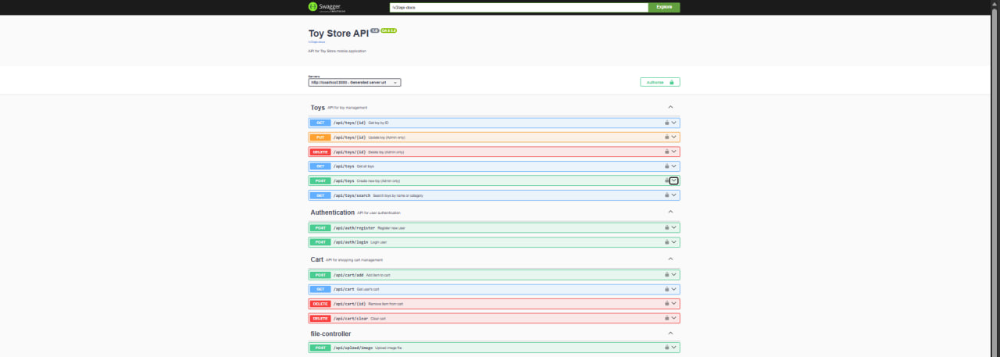

# Этап 7: Интерфейс (Недели 15–16)

## Цель этапа

Реализация и документирование пользовательского интерфейса мобильного приложения и серверного REST API. Обеспечение полного соответствия требованиям траектории В.

## Результаты

| Артефакт | Описание | Документ |
|------------|----------|----------|
| Мобильный интерфейс | 7 экранов, Material Design 3 | [mobile-screens.md](mobile-screens.md) |
| REST API | 13 эндпоинтов, OpenAPI | [api-endpoints.md](api-endpoints.md) |
| Безопасность | JWT, BCrypt, роли | [security.md](security.md) |
| Развёртывание | Запуск сервера и клиента | [deployment.md](deployment.md) |

## Скриншоты приложения

### 1. **Экран входа** (LoginScreen)

### 2. **Экран регистрации** (RegisterScreen)

### 3. **Каталог игрушек** (ToyListScreen)

### 4. **Детали товара** (ToyDetailScreen)

### 5. **Корзина** (CartScreen)

### 6. **Экран настроек** (SettingsScreen)

### 7: Оформление заказа (CheckoutDialog)

### 8. **Swagger UI документация API**
