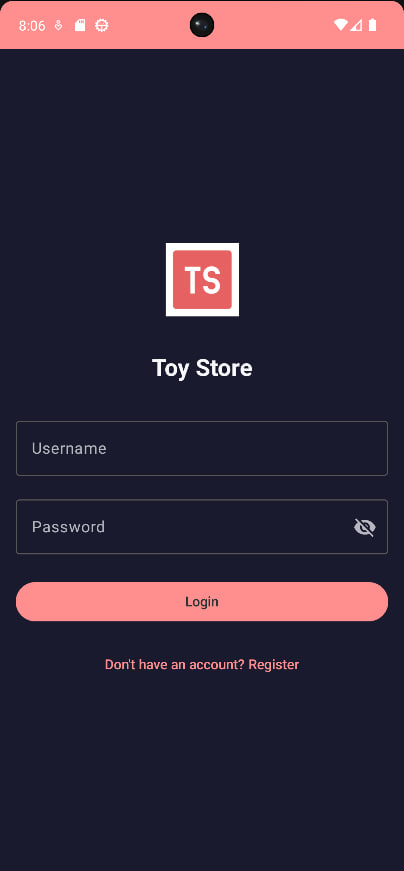
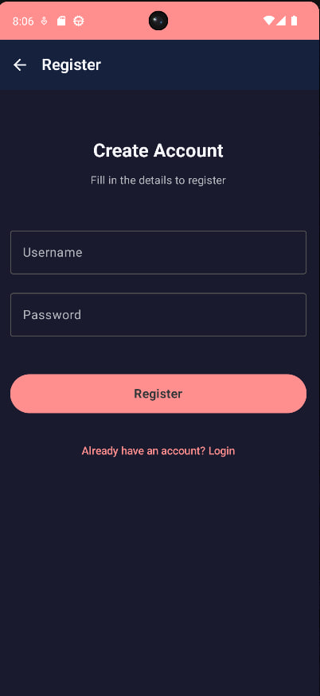
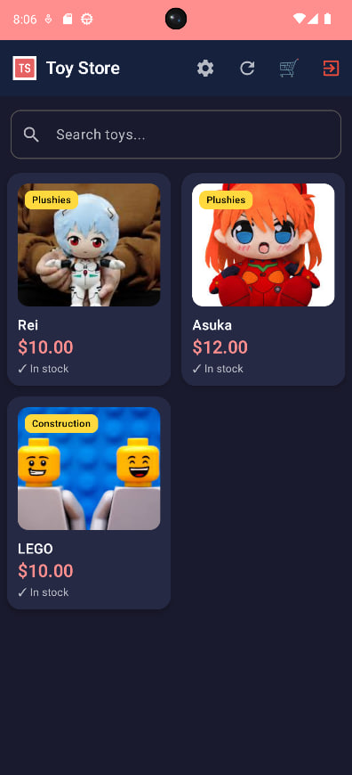
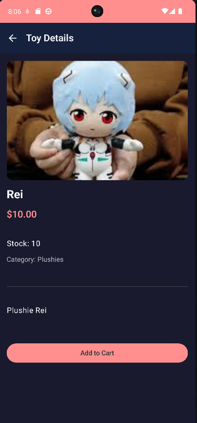
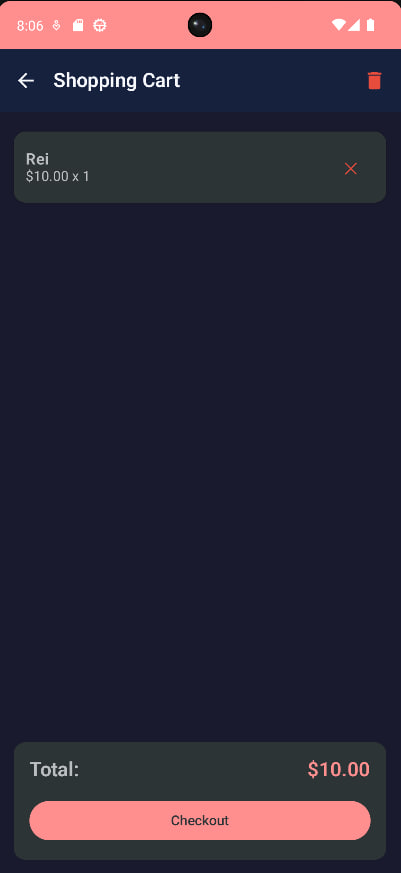
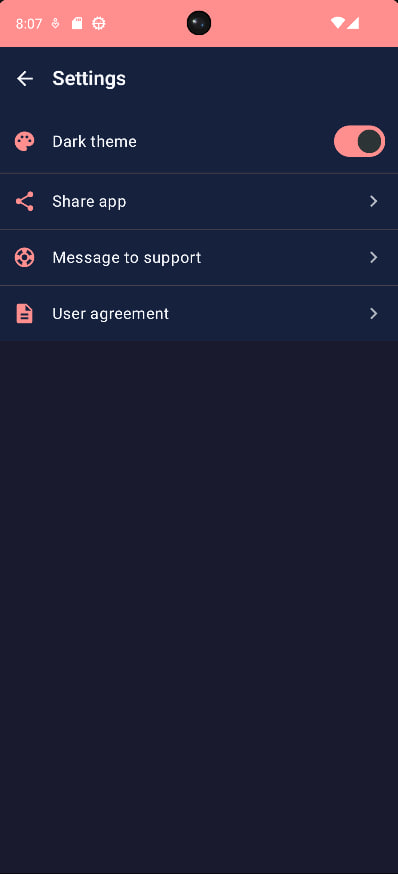
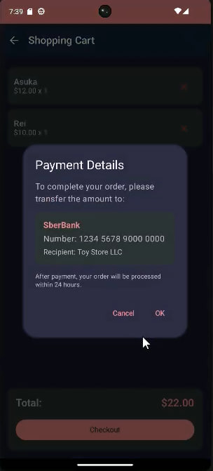

# Мобильный интерфейс (Android)

## Требования траектории В: 5+ экранов ✅ (реализовано 7)

---

## Экраны приложения

### Экран 1: Вход в систему (LoginScreen)


**Функции:**
- Ввод username и пароля
- Кнопка «Login»
- Переход на регистрацию
- Валидация полей
- Показ сообщения об ошибке при неверных данных

**Компоненты UI:**
- `TextField` для username и пароля
- `Button` — Login
- `Text` — ссылка на регистрацию
- `Snackbar` для ошибок

---

### Экран 2: Регистрация (RegisterScreen)


**Функции:**
- Ввод username, пароля, подтверждение пароля
- Валидация: username ≥ 3 символа, пароль ≥ 6 символов
- Переход на главный экран после успешной регистрации

**Компоненты UI:**
- Три `TextField`
- `Button` — Register
- Валидация в реальном времени

---

### Экран 3: Каталог игрушек (ToyListScreen)


**Функции:**
- Сетка товаров (2 колонки)
- Поиск по названию
- Фильтрация по категории
- Pull-to-refresh для обновления
- Переход к деталям товара по нажатию
- Отображение цены и наличия

**Компоненты UI:**
- `LazyVerticalGrid` (2 колонки)
- `Card` для каждого товара
- `TextField` для поиска
- `DropdownMenu` для фильтрации категорий
- `SwipeRefreshLayout` (pull-to-refresh)

---

### Экран 4: Детали товара (ToyDetailScreen)

**Функции:**
- Отображение изображения товара
- Название, описание, цена
- Выбор количества (степер +/−)
- Кнопка «Добавить в корзину»
- Кнопка «Назад»

**Компоненты UI:**
- `AsyncImage` (Coil) для загрузки изображения
- `Text` для описания
- `Row` со степером количества
- `Button` — Add to Cart
- `TopAppBar` с кнопкой Back

---

### Экран 5: Корзина (CartScreen)

**Функции:**
- Список товаров в корзине
- Изменение количества (+/−)
- Удаление товара
- Отображение итоговой суммы
- Кнопка «Checkout» (оформление заказа)
- Кнопка очистки корзины
- Пустое состояние (🛒 + «Your cart is empty»)

**Компоненты UI:**
- `LazyColumn` для списка
- `Card` для каждой позиции
- `Row` со степером и кнопкой удаления
- `Text` — Total: $XXX.XX
- `Button` — Checkout
- `AlertDialog` для подтверждения очистки

---

### Экран 6: Настройки (SettingsScreen)

**Функции:**
- Переключение тёмной/светлой темы
- Отображение username
- Кнопка «Logout»
- Информация о приложении

**Компоненты UI:**
- `Switch` — Dark Mode
- `Text` — username
- `Button` — Logout
- `Card` с версией приложения

---

### Экран 7: Оформление заказа (CheckoutDialog)

**Функции:**
- Отображение реквизитов для оплаты
- Копирование номера карты в буфер обмена
- Подтверждение заказа
- Отмена

**Компоненты UI:**
- `AlertDialog`
- `Text` — реквизиты
- `Button` — Copy Card Number
- `Button` — OK / Cancel
- `Snackbar` — «Card number copied!»

---

## Навигация между экранами

```
LoginScreen ─────────────────────────────────────> RegisterScreen
│
▼ (JWT получен)
ToyListScreen (главный экран)
│
├── [нажатие на товар] ─────────────────> ToyDetailScreen
│                                               │
│                                               └── [Add to Cart] → возврат
│
├── [иконка корзины] ─────────────────────> CartScreen
│                                               │
│                                               └── [Checkout] → Dialog
│
└── [меню] ─────────────────────────────────> SettingsScreen
```

---

## Соответствие требованиям Material Design 3

| Требование | Реализация |
|------------|------------|
| Цветовая схема | `colorPrimary`, `colorOnPrimary`, `colorSurface` |
| Компоненты | `Button`, `Card`, `TopAppBar`, `TextField` |
| Поля ввода | `TextField` с `OutlinedTextFieldColors` |
| Диалоги | `AlertDialog` из Material 3 |
| Навигация | `NavController` + sealed classes |
| Состояния | `StateFlow` + `collectAsStateWithLifecycle()` |
| Изображения | `AsyncImage` (Coil) с placeholder |