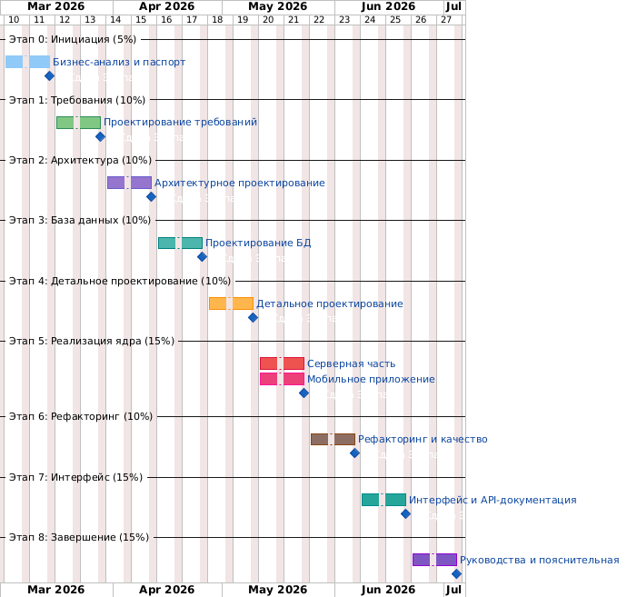

# Диаграмма Ганта

## Диаграмма

## Календарный план (18 недель)

| Этап | Недели | Период | Трудоёмкость |
|------|--------|--------|-------------|
| Этап 0: Инициация и бизнес-анализ | 1–2 | 01.03 – 14.03.2026 | 20 ч |
| Этап 1: Проектирование требований | 3–4 | 15.03 – 28.03.2026 | 18 ч |
| Этап 2: Архитектурное проектирование | 5–6 | 29.03 – 11.04.2026 | 16 ч |
| Этап 3: Проектирование БД | 7–8 | 12.04 – 25.04.2026 | 9 ч |
| Этап 4: Детальное проектирование | 9–10 | 26.04 – 09.05.2026 | 12 ч |
| Этап 5: Реализация ядра | 11–12 | 10.05 – 23.05.2026 | 85 ч |
| Этап 6: Рефакторинг | 13–14 | 24.05 – 06.06.2026 | 10 ч |
| Этап 7: Интерфейс | 15–16 | 07.06 – 20.06.2026 | — |
| Этап 8: Завершение | 17–18 | 21.06 – 04.07.2026 | 10 ч |

## Текстовая диаграмма Ганта

```
Этап                     | Нед: 1  2  3  4  5  6  7  8  9  10 11 12 13 14 15 16 17 18
-------------------------+-----------------------------------------------------------
0: Инициация             |      ████
1: Требования            |            ████
2: Архитектура           |                  ████
3: Проектирование БД     |                        ████
4: Детальное проект.     |                              ████
5: Реализация ядра       |                                    ████
6: Рефакторинг           |                                          ████
7: Интерфейс             |                                                ████
8: Завершение            |                                                      ████
```

## Контрольные точки (Milestones)

| Дата | Контрольная точка |
|------|-------------------|
| 14.03.2026 | Сдача Этапа 0: паспорт проекта, диаграммы, глоссарий |
| 28.03.2026 | Сдача Этапа 1: Use Case, Domain Model, спецификации |
| 11.04.2026 | Сдача Этапа 2: PCMEF-диаграммы, ADR |
| 25.04.2026 | Сдача Этапа 3: ER-диаграмма, DDL |
| 09.05.2026 | Сдача Этапа 4: диаграммы последовательности, классов |
| 23.05.2026 | Сдача Этапа 5: работающий сервер + приложение + тесты |
| 06.06.2026 | Сдача Этапа 6: отчёт анализа, рефакторинг |
| 20.06.2026 | Сдача Этапа 7: полный интерфейс, API-документация |
| 04.07.2026 | **Финальная защита**: пояснительная записка, презентация |
