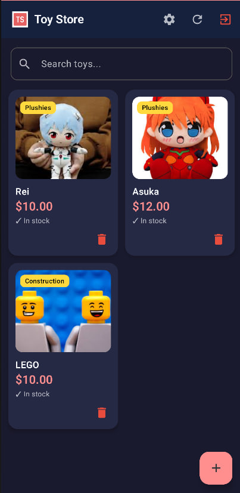
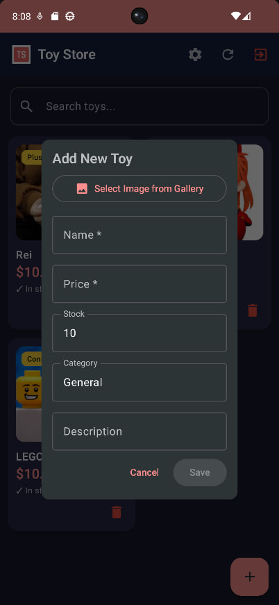
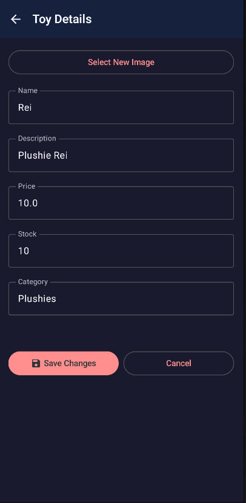

# Руководство пользователя

## Мобильное приложение «Toy Store»

### Содержание

1. [Начало работы](#1-начало-работы)
2. [Регистрация и вход](#2-регистрация-и-вход)
3. [Работа с каталогом](#3-работа-с-каталогом)
4. [Просмотр товара](#4-просмотр-товара)
5. [Работа с корзиной](#5-работа-с-корзиной)
6. [Настройки](#6-настройки)
7. [Администрирование](#7-администрирование)
8. [Работа без интернета](#8-работа-без-интернета)

---

## 1. Начало работы

### 1.1 Установка

1. Получите файл `app-debug.apk` от разработчика
2. На устройстве разрешите установку из неизвестных источников: **Настройки → Безопасность → Неизвестные источники**
3. Откройте APK-файл и нажмите **Установить**
4. После установки запустите приложение с рабочего стола

---

## 2. Регистрация и вход

### 2.1 Регистрация

1. При первом запуске нажмите **Зарегистрироваться**
2. Введите логин (3–50 символов, уникальный)
3. Введите пароль (минимум 6 символов)
4. Нажмите **Зарегистрироваться**
5. После успешной регистрации вы автоматически войдёте в систему

### 2.2 Вход

1. Введите логин и пароль
2. Нажмите **Войти**
3. При успешной аутентификации откроется главный экран — каталог игрушек

⚠️ Если данные введены неверно, появится сообщение «Неверный логин или пароль»

---

## 3. Работа с каталогом

### 3.1 Главный экран

На главном экране отображается каталог игрушек в виде сетки (2 колонки). Каждая карточка показывает:
- Изображение товара
- Название
- Цену
- Наличие на складе

### 3.2 Поиск игрушек

1. Введите название игрушки в поле поиска
2. Список автоматически отфильтруется по введённому запросу
3. Для сброса поиска очистите поле

### 3.3 Фильтрация по категории

1. Нажмите на фильтр категорий
2. Выберите нужную категорию (например, «Мягкие игрушки», «Конструкторы»)
3. Каталог отобразит только товары выбранной категории

---

## 4. Просмотр товара

### 4.1 Детали товара

1. Нажмите на карточку товара
2. Откроется экран с подробной информацией:
   - Большое изображение
   - Полное описание
   - Цена
   - Остаток на складе
   - Кнопка «Добавить в корзину»

### 4.2 Добавление в корзину

1. На экране деталей товара нажмите **«Добавить в корзину»**
2. Если товара недостаточно на складе — появится предупреждение
3. При успешном добавлении отобразится уведомление «Товар добавлен в корзину»
4. Иконка корзины обновится с отображением количества товаров

---

## 5. Работа с корзиной

### 5.1 Просмотр корзины

1. Нажмите на иконку корзины в главном меню
2. Откроется экран корзины со списком товаров, количеством и итоговой суммой

### 5.2 Изменение количества

- Рядом с каждым товаром есть кнопки «+» и «−» для изменения количества

### 5.3 Удаление товара

- Нажмите на иконку «✕» рядом с товаром — он будет удалён из корзины

### 5.4 Очистка корзины

1. Нажмите на иконку корзины в правом верхнем углу
2. Подтвердите удаление
3. Все товары будут удалены

### 5.5 Оформление заказа

1. Нажмите кнопку **«Checkout»** внизу экрана
2. Откроется диалог с реквизитами для оплаты
3. Нажмите на номер карты — он скопируется в буфер обмена
4. Нажмите **OK** для подтверждения
5. Корзина будет очищена, заказ оформлен

---

## 6. Настройки

### 6.1 Переход в настройки

1. Нажмите на иконку меню
2. Выберите **Настройки**

### 6.2 Смена темы

- Переключите тумблер **Dark Mode** для смены между светлой и тёмной темой
- Настройка сохраняется между запусками

### 6.3 Информация о пользователе

На экране настроек отображается:
- Ваш логин
- Роль (USER / ADMIN)

### 6.4 Выход из аккаунта

1. Нажмите **Logout**
2. Токен будет удалён
3. Приложение вернётся на экран входа

---

## 7. Администрирование

### 7.1 Вход в режим администратора

Если ваша учётная запись имеет роль **ADMIN**, вам доступны дополнительные функции управления каталогом.

### 7.2 Просмотр каталога (Admin)

Администратор может просматривать полный каталог товаров с расширенной информацией.

### 7.3 Добавление товара

1. Нажмите кнопку **«Добавить товар»**
2. Заполните поля:
   - Название (обязательно)
   - Описание
   - Цена
   - Категория
   - Остаток на складе
   - URL изображения (опционально)
3. Нажмите **Сохранить**

### 7.4 Редактирование товара

1. В каталоге выберите товар для редактирования
2. Нажмите кнопку **«Изменить»**
3. Внесите необходимые изменения
4. Нажмите **Сохранить**

### 7.5 Удаление товара

⚠️ **Внимание!** При удалении товара он будет безвозвратно удалён из каталога. Связанные записи в корзинах также будут удалены.

1. В каталоге выберите товар
2. Нажмите кнопку **«Удалить»**
3. Подтвердите удаление

---

## 8. Работа без интернета

Приложение поддерживает оффлайн-режим:

✅ **Доступно без интернета:**
- Просмотр каталога из локального кэша

❌ **Требует подключения:**
- Оформление заказа
- Синхронизация данных
- Загрузка новых изображений

При отсутствии сети вверху экрана появится индикатор **«Оффлайн»**

---

## 9. Системные требования

| Параметр | Требование |
|----------|------------|
| Android версия | 8.0 (API 26) и выше |
| Свободная память | 50 МБ |
| Интернет | Необходим для входа и синхронизации |
| Разрешение экрана | От 720×1280 |

---

## 10. Частые вопросы

### В: Почему не отображаются товары?
**О:** Проверьте подключение к интернету. Если сеть есть — потяните каталог вниз для обновления.

### В: Как изменить пароль?
**О:** В текущей версии смена пароля не реализована. Обратитесь к администратору.

### В: Что делать, если товар закончился?
**О:** Товар исчезнет из каталога или станет недоступен для добавления в корзину.

### В: Как связаться с поддержкой?
**О:** Напишите на proncha200484@gmail.com

---

