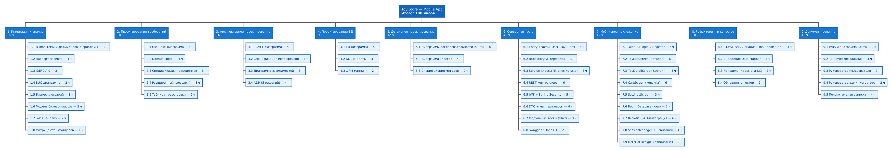

# WBS — Иерархическая структура работ

## Диаграмма

## Декомпозиция работ

### 1. Инициация и анализ (Этап 0)

| ID | Работа | Трудоёмкость (ч) |
|----|--------|-------------------|
| 1.1 | Выбор темы и формулировка проблемы | 3 |
| 1.2 | Разработка паспорта проекта | 4 |
| 1.3 | Построение диаграммы IDEF0 A-0 | 3 |
| 1.4 | Построение BUC-диаграммы | 2 |
| 1.5 | Составление бизнес-глоссария | 3 |
| 1.6 | Построение модели бизнес-классов | 2 |
| 1.7 | SWOT-анализ | 2 |
| 1.8 | Матрица стейкхолдеров | 1 |
| **Итого 1** | | **20** |

### 2. Проектирование требований (Этап 1)

| ID | Работа | Трудоёмкость (ч) |
|----|--------|-------------------|
| 2.1 | Построение Use Case диаграммы | 4 |
| 2.2 | Разработка Domain Model | 4 |
| 2.3 | Спецификации прецедентов (4 UC) | 5 |
| 2.4 | Расширенный глоссарий | 3 |
| 2.5 | Таблица трассировки требований | 2 |
| **Итого 2** | | **18** |

### 3. Архитектурное проектирование (Этап 2)

| ID | Работа | Трудоёмкость (ч) |
|----|--------|-------------------|
| 3.1 | Диаграмма пакетов PCMEF | 5 |
| 3.2 | Спецификация интерфейсов | 4 |
| 3.3 | Диаграмма зависимостей | 3 |
| 3.4 | ADR (5 решений) | 4 |
| **Итого 3** | | **16** |

### 4. Проектирование БД (Этап 3)

| ID | Работа | Трудоёмкость (ч) |
|----|--------|-------------------|
| 4.1 | ER-диаграмма | 4 |
| 4.2 | DDL-скрипты | 3 |
| 4.3 | Описание ORM-маппинга | 2 |
| **Итого 4** | | **9** |

### 5. Детальное проектирование (Этап 4)

| ID | Работа | Трудоёмкость (ч) |
|----|--------|-------------------|
| 5.1 | Диаграммы последовательности (4 шт.) | 6 |
| 5.2 | Диаграмма классов проектирования | 4 |
| 5.3 | Спецификация методов | 2 |
| **Итого 5** | | **12** |

### 6. Реализация серверной части (Этап 5)

| ID | Работа | Трудоёмкость (ч) |
|----|--------|-------------------|
| 6.1 | Entity-классы (User, Toy, Cart) | 4 |
| 6.2 | Repository-интерфейсы | 3 |
| 6.3 | Service-классы (бизнес-логика) | 8 |
| 6.4 | REST-контроллеры | 6 |
| 6.5 | JWT + Spring Security конфигурация | 5 |
| 6.6 | DTO + маппер-классы | 4 |
| 6.7 | Модульные тесты (JUnit) | 8 |
| 6.8 | Swagger / OpenAPI настройка | 2 |
| **Итого 6** | | **40** |

### 7. Реализация мобильного приложения (Этап 5–7)

| ID | Работа | Трудоёмкость (ч) |
|----|--------|-------------------|
| 7.1 | Экраны Login и Register | 5 |
| 7.2 | ToyListScreen (каталог) | 6 |
| 7.3 | ToyDetailScreen (детали) | 5 |
| 7.4 | CartScreen (корзина) | 6 |
| 7.5 | SettingsScreen | 3 |
| 7.6 | Room Database (кэш) | 5 |
| 7.7 | Retrofit + API-интеграция | 6 |
| 7.8 | SessionManager + навигация | 4 |
| 7.9 | Material Design 3 стилизация | 2 |
| **Итого 7** | | **42** |

### 8. Рефакторинг и тестирование (Этап 6)

| ID | Работа | Трудоёмкость (ч) |
|----|--------|-------------------|
| 8.1 | Статический анализ (Android Lint, SonarQube) | 3 |
| 8.2 | Внедрение Data Mapper | 3 |
| 8.3 | Исправление проблем анализа | 2 |
| 8.4 | Обновление тестов | 2 |
| **Итого 8** | | **10** |

### 9. Документирование (Этап 8)

| ID | Работа | Трудоёмкость (ч) |
|----|--------|-------------------|
| 9.1 | WBS и диаграмма Ганта | 2 |
| 9.2 | Техническое задание | 3 |
| 9.3 | Руководство пользователя | 2 |
| 9.4 | Руководство администратора | 2 |
| 9.5 | Пояснительная записка | 4 |
| **Итого 9** | | **13** |

## Сводная таблица трудозатрат

| Этап | Часов |
|------|-------|
| 1. Инициация и анализ | 20 |
| 2. Требования | 18 |
| 3. Архитектура | 16 |
| 4. БД | 9 |
| 5. Детальное проектирование | 12 |
| 6. Серверная часть | 40 |
| 7. Мобильное приложение | 42 |
| 8. Рефакторинг | 10 |
| 9. Документирование | 13 |
| **Итого** | **180 часов** |
